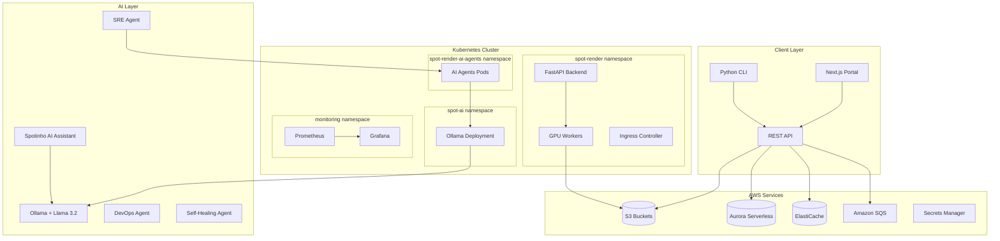
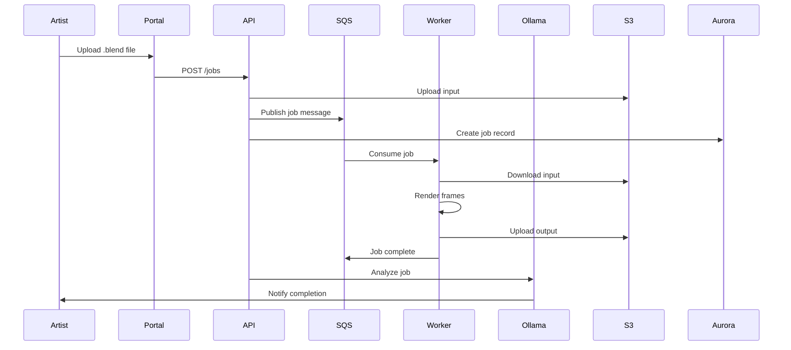
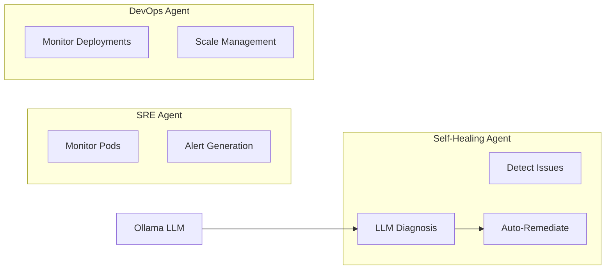

# Spot Render - Project Overview
# Distributed 3D Rendering Platform with Autonomous AIOps

---

## 1. Visão Geral / Overview

### PT-BR
**Spot Render** é uma plataforma de renderização 3D distribuída construída sobre Kubernetes, projetada para processar jobs de renderização Blender/Cycles em larga escala. A plataforma integra agentes autônomos de AIOps que monitoram, diagnosticam e auto-recuperam a infraestrutura 24/7, utilizando LLMs locais (Ollama + Llama 3.2) com custo zero em API keys.

### EN
**Spot Render** is a distributed 3D rendering platform built on Kubernetes, designed to process Blender/Cycles rendering jobs at scale. The platform integrates autonomous AIOps agents that monitor, diagnose, and self-heal infrastructure 24/7, using local LLMs (Ollama + Llama 3.2) with zero API key costs.

---

## 2. Stack Tecnológica / Technology Stack

### PT-BR
A plataforma utiliza uma stack moderna e robusta, com foco em escalabilidade, observabilidade e automação inteligente.

### EN
The platform uses a modern and robust stack, focusing on scalability, observability, and intelligent automation.

| Component | Technology | Purpose |
|-----------|------------|---------|
| **API** | Python 3.12 + FastAPI 0.136 | REST API for job management |
| **Workers** | Blender 5.1.0 + CUDA 12.6 | GPU-accelerated rendering |
| **Frontend** | Next.js 14 + React 18 | Web portal UI |
| **CLI** | Python 3.12 + Click | Command-line interface |
| **IaC** | Terraform 1.9+ | Infrastructure as Code |
| **Orchestration** | Kubernetes 1.29 (EKS/Kind) | Container orchestration |
| **GitOps** | ArgoCD + Kustomize | Git-based deployment |
| **CI/CD** | GitHub Actions | Automated pipelines |
| **Database** | Aurora PostgreSQL Serverless v2 | Serverless relational DB |
| **Cache** | ElastiCache Redis | Caching & sessions |
| **Messaging** | Amazon SQS + DLQ | Job queue management |
| **LLM** | Ollama + Llama 3.2 | Local AI inference |
| **Monitoring** | Prometheus + Grafana | Metrics & dashboards |
| **Registry** | Amazon ECR / Docker Hub | Container images |

---

## 3. Arquitetura / Architecture

### 3.1 High-Level Architecture Diagram



### 3.2 Data Flow / Fluxo de Dados



### 3.3 ADR Outcomes / Decisões Arquiteturais

#### PT-BR
Decisões arquiteturais-chave que definem a基础设施 da plataforma.

#### EN
Key architectural decisions that define the platform infrastructure.

| Decision | Choice | Rationale |
|----------|--------|-----------|
| **Database** | Aurora PostgreSQL Serverless v2 | Pay-per-use, auto-scaling 0.5-96 ACUs, Multi-AZ |
| **Messaging** | Amazon SQS + DLQ | Managed queue, $0.40/M messages, 4-day retention |
| **Cache** | ElastiCache Redis | Session storage, rate limiting, job caching |
| **LLM** | Ollama + Llama 3.2 | $0 cost, local inference, privacy-first |
| **Storage** | S3 with lifecycle | Input/error buckets with expiration policies |
| **Secrets** | AWS Secrets Manager | IAM integration, automatic rotation, KMS encryption |

---

## 4. Features Principais / Key Features

### PT-BR
A plataforma oferece um conjunto completo de funcionalidades para renderização distribuída com operacionalização inteligente.

### EN
The platform offers a complete feature set for distributed rendering with intelligent operations.

| Feature | Description |
|---------|-------------|
| **Distributed Rendering** | GPU-accelerated Blender/Cycles on Kubernetes |
| **Canary Deployments** | Argo Rollouts with 10%→50%→100% steps |
| **Auto-scaling** | HPA for API (3-15) and workers (2-30 replicas) |
| **Self-Healing** | Autonomous detection and remediation of issues |
| **AI Assistant** | Spotinho chatbot with RAG knowledge base |
| **GitOps** | ArgoCD + Kustomize with automated sync |
| **Health Checks** | Liveness, readiness, and startup probes |
| **Multi-format Support** | .blend, .max, .fbx, .obj, .usd, .abc |

---

## 5. Ganhos / Gains

### 5.1 Estratégicos / Strategic

#### PT-BR
- **Primeiro-mover**: Primeira plataforma de renderização com AIOps autônomo integrado
- **Vendor-lock-in avoidance**: 100% IaC com Terraform, portável para qualquer cloud
- **Escalabilidade infinita**: Kubernetes permite expandir de 1 a 1000 nodes

#### EN
- **First-mover**: First rendering platform with integrated autonomous AIOps
- **Vendor-lock-in avoidance**: 100% IaC with Terraform, portable to any cloud
- **Infinite scalability**: Kubernetes allows expanding from 1 to 1000 nodes

### 5.2 Operacionais / Operational

| Metric | Value |
|--------|-------|
| **MTTD** (Mean Time to Detect) | < 5 minutes |
| **MTTR** (Mean Time to Remediate) | < 15 minutes |
| **Self-healing success rate** | > 80% |
| **API availability SLO** | 99.9% (43.8 min/month) |
| **Agent uptime** | 24/7 autonomous monitoring |

### 5.3 Financeiros / Financial

| Component | Savings |
|-----------|---------|
| **LLM Inference** | $0/month (Ollama local vs $0.002/1K tokens OpenAI) |
| **GPU Workers** | 60-70% savings with Spot instances |
| **Database** | Aurora Serverless = pay-per-use vs always-on |
| **Queue** | SQS = $0.40/M vs Kafka ~$100/month |
| **Total estimated savings** | $500-1000/month vs managed alternatives |

---

## 6. Métricas e Resultados / Metrics & Results

### PT-BR
A plataforma expõe métricas detalhadas para monitoramento e tomada de decisão.

### EN
The platform exposes detailed metrics for monitoring and decision-making.

### Prometheus Metrics

```yaml
# Job metrics
render_success_total{project, artist}      # Successful renders
render_error_total{project, artist}       # Failed renders
render_queue_total{project, artist}       # Pending uploads
render_duration_seconds                   # Render duration

# Canary metrics
render_canary_requests_total{version}    # Canary traffic
render_canary_error_rate                 # Error rate (threshold: >1%)

# Ollama metrics
ollama_up                               # Service status (1=up)
ollama_api_requests_total                # Total API requests
ollama_api_request_duration_seconds      # Request latency
ollama_active_connections                # Current connections

# Agent metrics
agent_remediations_total                 # Total remediation actions
agent_remediations_successful           # Successful actions
agent_mttd_minutes                      # Mean time to detect
agent_mttr_minutes                      # Mean time to remediate
```

### SLO Targets

| Service | Availability | Error Budget (monthly) |
|---------|--------------|------------------------|
| API | 99.9% | 43.8 minutes |
| Portal | 99.5% | 3.6 hours |
| Ollama | 99.0% | 7.3 hours |

---

## 7. AIOps & IA / AI Capabilities

### 7.1 Agentes Autônomos / Autonomous Agents

#### PT-BR
A plataforma utiliza 3 agentes autônomos especializados que operam 24/7 para manter a infraestrutura saudável.

#### EN
The platform uses 3 specialized autonomous agents that operate 24/7 to keep infrastructure healthy.

| Agent | Type | Function |
|-------|------|----------|
| **SRE Agent** | DaemonSet | Cluster health monitoring, unhealthy pod detection |
| **DevOps Agent** | Deployment | Deployment monitoring, replica tracking |
| **Self-Healing Agent** | Deployment | LLM-powered diagnosis, automatic remediation |

#### Agent Architecture



### 7.2 Spotinho (AI Assistant)

#### PT-BR
Chatbot de IA integrado que responde perguntas sobre a plataforma usando RAG (Retrieval Augmented Generation).

#### EN
Integrated AI chatbot that answers questions about the platform using RAG (Retrieval Augmented Generation).

| Feature | Description |
|---------|-------------|
| **Model** | Llama 3.2 (local Ollama) |
| **Context** | RAG with platform knowledge base |
| **Temperature** | 0.7 (balanced creativity) |
| **Max tokens** | 2048 |
| **Timeout** | 180 seconds |
| **Cost** | $0/month |

---

## 8. Monitoramento e Observabilidade / Monitoring & Observability

### PT-BR
A plataforma segue as Quatro Sinais Dourados do SRE para garantir observabilidade completa.

### EN
The platform follows the Four Golden Signals of SRE for complete observability.

### Four Golden Signals

| Signal | Metrics |
|--------|---------|
| **Latency** | p50, p95, p99 response times |
| **Traffic** | Requests per second, frames per minute |
| **Errors** | Error rate, 5xx rate, canary error rate |
| **Saturation** | CPU%, memory%, disk%, queue depth |

### Dashboards

| Dashboard | Metrics |
|-----------|---------|
| **Spot Render - Pipeline** | Frames/min, worker CPU, 5xx rate, p95 latency |
| **Spot Render - Ollama** | Status, request rate, latency, memory/CPU |
| **Spot Render - AI Agents** | Agent status, SRE errors, self-healing remediations |

### Alert Rules

```yaml
# High-priority alerts
- alert: APIHighErrorRate
  expr: rate(http_requests_total{status!~"2.."}[5m]) > 0.01
  severity: critical

- alert: CanaryErrorRateHigh
  expr: rate(http_requests_total{version="canary",status!~"2.."}[5m]) > 0.01
  severity: critical

- alert: SelfHealingLowSuccessRate
  expr: (rate(self_healing_agent_remediations_successful[1h]) / rate(self_healing_agent_remediations_total[1h])) < 0.8
  severity: warning

- alert: OllamaDown
  expr: absent(ollama_up == 1)
  severity: critical
```

---

## 9. Segurança / Security

### PT-BR
A plataforma implementa múltiplas camadas de segurança.

### EN
The platform implements multiple security layers.

| Layer | Mechanism |
|-------|-----------|
| **Secrets** | AWS Secrets Manager with KMS encryption |
| **Network** | VPC with public/private subnets, NAT Gateway |
| **WAF** | AWS WAF with OWASP rules, rate limiting |
| **Containers** | Trivy scanning in CI/CD pipeline |
| **SAST** | Semgrep analysis on codebase |
| **IaC Scanning** | Checkov for Terraform misconfigs |
| **Secrets Detection** | Gitleaks for credential scanning |

---

## 10. Comandos Essenciais / Essential Commands

### PT-BR
Comandos mais utilizados para operação da plataforma.

### EN
Most commonly used commands for platform operation.

```bash
# === Cluster Status ===
kubectl get pods -A                                    # All pods
kubectl get pods -n spot-render                        # spot-render namespace
kubectl get pods -n spot-ai                           # spot-ai namespace
kubectl get pods -n spot-render-ai-agents             # AI agents namespace

# === Ollama ===
kubectl exec -n spot-ai deploy/ollama -- ollama list           # List models
kubectl exec -n spot-ai deploy/ollama -- ollama run llama3.2 "ping"  # Test model

# === AIOps Agents ===
kubectl get pods -n spot-render-ai-agents                         # List agents
kubectl logs -n spot-render-ai-agents deployment/sre-agent       # SRE logs
kubectl logs -n spot-render-ai-agents deployment/self-healing-agent  # Self-healing logs

# === HPAs & Scaling ===
kubectl get hpa -A                                      # All HPAs
kubectl top nodes                                       # Node metrics
kubectl top pods -n spot-render                         # Pod metrics

# === ArgoCD ===
argocd app list                                        # List applications
argocd app sync <app-name>                             # Sync application
kubectl argo rollouts get rollout spot-render-backend -n spot-render  # Rollout status

# === Monitoring ===
kubectl port-forward -n monitoring svc/prometheus 9090   # Prometheus
kubectl port-forward -n monitoring svc/grafana 3000      # Grafana

# === API Health ===
curl -s http://api.spot-render.local/health/summary     # API health check
curl -s http://spot-render.local/ai/status              # Ollama status

# === Terraform ===
cd infra-terraform-root && terraform plan                # Plan changes
cd infra-terraform-root && terraform apply              # Apply changes
```

---

## 11. Repositórios / Repositories

| Repository | Description |
|------------|-------------|
| `spot-render` | Main project (Terraform, K8s, CI/CD, agents) |
| `spot-render-api` | FastAPI service for uploads/jobs |
| `spot-render-portal` | Next.js web UI |
| `spot-render-cli` | Python CLI for uploads |
| `spot-render-argo` | Argo Workflows + Blender scripts |
| `spot-render-infra-aws` | Terraform AWS foundation |
| `spot-render-observability` | Prometheus exporter + Grafana |
| `spot-render-ollama` | Ollama LLM server (Kubernetes) |
| `spot-render-ia-auto-agents` | Autonomous AI agents |
| `spot-render-teste-local` | Local dev environment (Kind/Docker Desktop) |
| `spot-render-config` | Central documentation |

---

## 12. Getting Started / Primeiros Passos

### PT-BR
Para começar a usar a plataforma localmente ou em produção.

### EN
To get started using the platform locally or in production.

```bash
# === Local Development ===
git clone https://github.com/raafa001/spot-render-teste-local
cd spot-render-teste-local
./setup-local.sh

# === Deploy to AWS ===
cd spot-render-infra-aws
terraform init
terraform plan
terraform apply

# === Connect ArgoCD ===
argocd cluster add <context>
argocd app create spot-render --repo https://github.com/raafa001/spot-render.git --path k8s/overlays/prod
argocd app sync spot-render
```

---

## 13. Suporte e Contribuição / Support & Contribution

### PT-BR
Contribuições são bem-vindas! Por favor, siga as diretrizes de contribuição.

### EN
Contributions are welcome! Please follow the contribution guidelines.

```bash
# Report issues
https://github.com/raafa001/spot-render/issues

# Pull requests
https://github.com/raafa001/spot-render/pulls
```

---

**Document Version:** 1.0.0
**Last Updated:** 2026-07-19
**Maintained by:** Spot Render Team
